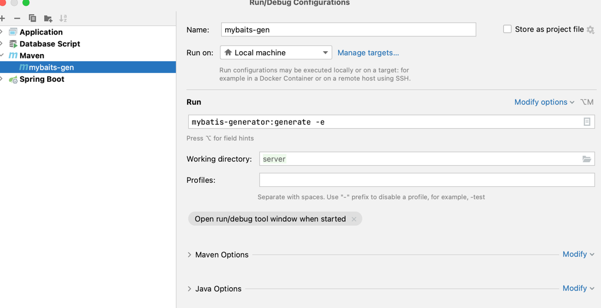

## 简介
 造个轮子。自己小私活使用脚手架
* 前端采用Vue、bootstrap、blockUI等。
* 后端采用Springcloud eureka 注册中心 freemarker模板引擎、Redis中间件等。

## 环境搭建
*  jdk8 以及以上
*  mysql 开发用8 mysql5.7未测试

## 快速生成代码方法：
* 在server模块下执行 mybatis-generator:generate -e
  idea 配置如下图
* 
* generatorConfig.xml中修改要生成的表（先建表）
* 执行VueGenerator和ServerGenerator

## 本地启动
* 启动顺序 eurekaApplication gatewayApplication systemApplication BussinessApplication.

## linux启动 回头加入启动脚本

## 此框架本人自用，如果需要生产慎用。后果自负
  